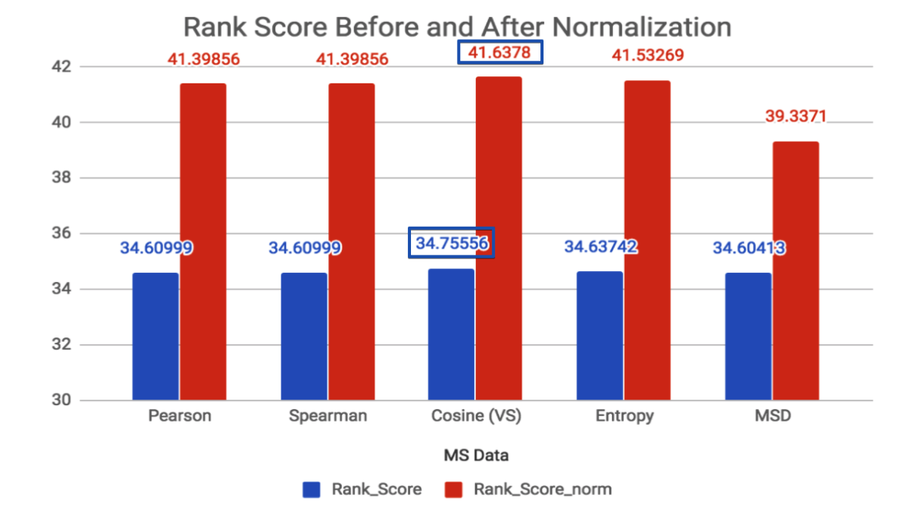
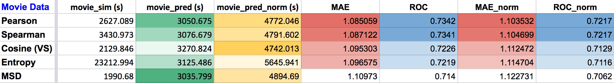

## Project summary: 

Used 2 types of collaborative filtering algorithms: Memory-based and Model-based on 2 data sets, [`Ananoymous Microsoft Web`](https://archive.ics.uci.edu/ml/datasets/Anonymous+Microsoft+Web+Data) for implicit rating (website visited or not, 1 or 0), and [`EachMovie`](http://www.gatsby.ucl.ac.uk/~chuwei/data/EachMovie/eachmovie.html) for explicit rating (voting value between 0 and 5), to predict users' ratings on webpages or movies they have't rated, which indicates they might not know thesed items, and based on the ratings, these items could be good recommendations for them. Details can be found in [`main.R`](https://github.com/ginnyqg/collaborative-filtering/blob/master/doc/main.R).

## Memory-based Algorithm:

Computed different similarity weights, predicted ratings on training data and compared with test, applied rating normalization to examine if this change enhances model performance. 

For Microsft data, model performance from using different similarity weights is very close, with vector similarity slightly tops the evaluation metric used here: rank score. Pearson takes least amount of time to run prediction, its rank score is the same as Spearman. After using rating normalization, model performance showed improvements for all similarity weights. 

Vector similarity stays top and uses least amount of time. Entropy comes next in rank score, but it uses significantly longer time to compute similarity weight, more than 20 times than MSD. MSD takes least amount of time to calculate similarity though its rank score is lowest before and after normalization.

For movie data, Pearson and Spearman show best performance using Mean Absolute Error (MAE) and ROC before and after normalization. They take similar amout of time to run as the most time-efficient one. Same as in Microsoft data, vector similary and entropy are comparable in performance scoring (MAE and ROC), but entropy takes much longer to generate similarity weight. MSD uses least amount of time but performed less well than other similarity weights.

